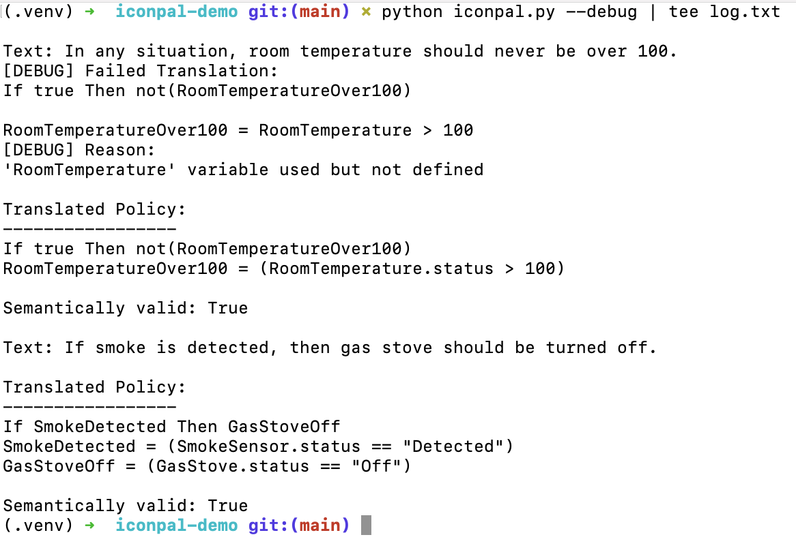

### iConPAL: LLM-guided Policy Authoring Assistant for Configuring IoT Defenses

iConPAL is a fully automated policy authoring assistant for IoT environments. It accepts a policy description in natural language (English) and translates it into a specific formal policy language. iConPAL leverages the capabilities of modern large language models (LLMs), employs prompt engineering to automatically generate few-shot learning prompts for the LLM, and post-processes the LLM’s response to ensure the validity of the translated policy. We implemented a prototype of iConPAL and evaluated it on our curated dataset of 290 policy translation examples. We observed that iConPAL successfully translated 93.61% policies, of which 93.57% were also semantically valid. iConPAL’s high accuracy makes it suitable for assisting ordinary users in drafting policies for smart homes.

### Disclaimer

This repository contains the code for the iConPAL demo only and supports GPT 3.5 and GPT 4 models only whearas the full implementation supports other LLMs including LLama 2 13B, LLama 2 70 B, Mistral, Mixtral, and Yi 34B. It uses a subset of policy translation examples in the prompt whereas the full implementation contains 3 example translatins from each of 8 categories (24 in total). Moreover, it requires manual categorization of the input policy texts whereas the full implementation supports automated categorization of the input policy text. The full implementation of the iConPAL system will be released upon acceptance of the paper.

### Installation

```
python -m venv .venv
source .venv/bin/activate
pip install -r requirements.txt
```

### Usage

```
python iconpal.py --help      
usage: Translate natural policy text to formal policy [-h] [--dry-run]
                                                      [-m {gpt-3.5-turbo,gpt-4-turbo}]
                                                      [-d]

options:
  -h, --help            show this help message and exit
  --dry-run             Dry run
  -m {gpt-3.5-turbo,gpt-4-turbo}, --model {gpt-3.5-turbo,gpt-4-turbo}
                        Model to use
  -d, --debug           Debug mode
```

### Knolwedge Base

The knowledge base of iConPAL is stored in the `knowledge-base` directory. It contains the following files:

- [Policy Tutorial](knowledge-base/tutorial.md)
- [Examples](knowledge-base/examples.json)

iConPAL utilize the knowledge base to generate few-shot learning prompts for the large language model (LLM).

### Inputs

Inputs to iConPAL are listed in `inputs.json` file. Each input is a JSON object with the following fields:
- text: The natural language policy description.
- category: The category of the policy.

**Note:** The `category` field is required for this demo implementation. The full implementation of iConPAL supports automated categorization of the input policy text, so you can ignore this field in the full implementation. This demo supports only two categories: `Unconditional Statement`(G1) and `Complex Statement`(G7) because the `examples.json` contains example translations for these two categories only.

### Demo

